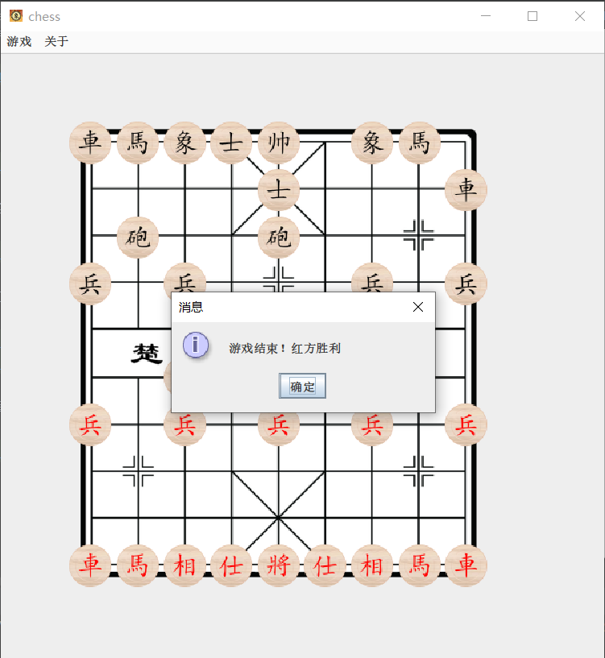

# 中国象棋

### 作者

徐吕进 杨贺森 吴建宇

### 编译环境

JDK 16 以上。

### 最新版本

请前往 https://github.com/i-bara/chess 获取最新的版本。

### 游戏介绍

打开应用程序，出现中国象棋游戏的棋盘界面。此时游戏已经初始化完成。

红方先手，您可以把鼠标移动到红方棋子上，鼠标将会变为手的形状，随后点击该棋子，再点击要移动的位置，即完成一次移动。

移动后，轮到黑方，这时您可以把鼠标移动到黑方棋子上，同样地点击该棋子以完成移动。

随后如果红方用炮吃掉对方的兵，将弹出对话框“将军！”，点击“确定”后，炮随之移动到相应位置。

随后如果黑方不顾将军，走其他的棋子，将弹出对话框“不能这样走，否则就输了。”，该移动不会执行。

经过若干步后，红方的某一移动将将死黑方，将弹出对话框“游戏结束！红方胜利”。

本游戏内置诸多功能，包括“撤回”、“重做”和“棋谱”。如果黑方不愿意，他可以使用撤回功能使得刚刚红方的将死无效，棋子将回到原位。

除此之外，“撤回”和“重做”还可以一次性操作多步。使用快捷键或点击菜单，将弹出对话框“请输入要撤回的步数。”，输入相应数字后棋子将会执行。

点击“棋谱”菜单，将打开一个新的棋谱窗口。这个窗口保存了刚刚对局的所有完整信息，您可以按下鼠标左键以查看前一步的棋盘，或按下鼠标右键以查看后一步的棋盘。

如果想要再来一局，点击“重置”菜单，一切都将像从未发生过一样。

新增“超级模式”玩法！点击“超级模式菜单”，将弹出对话框“您确认要游玩超级模式吗”。点击确认，您将扮演一名将军，带领四十四个士兵与敌方作战。

新增 AI 功能！点击“红方 AI”菜单，红方将由 AI 控制！如果同时点击“红方 AI”和“黑方 AI”菜单，就可以观看 AI 的对局了！

